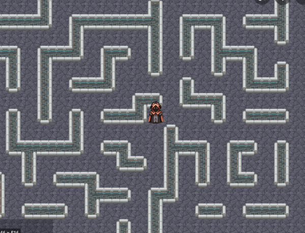
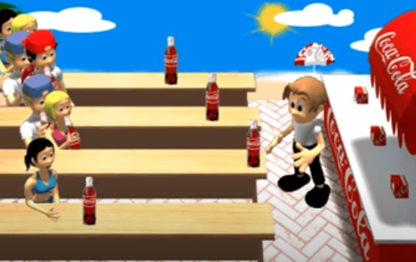
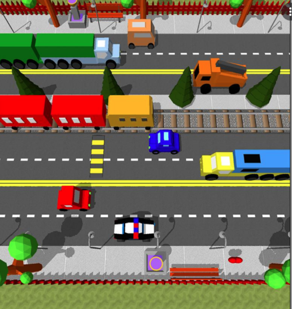

# Juego de Aventura (titulo momentaneo)
Se tratará de un trabajador/a que va a tener que ingeniárselas para poder llegar temprano a su
trabajo con las bebidas que le pidieron sus compañeros, en caso contrario lo despedirán!

Se dividirá en 3 fases(Imagenes de ejemplo):

-Fase 1 Laberinto para obtener la llave de la casa y la billetera

	
-Fase 2 Obtener los cafes en la cafeteria

	
-Fase 3 Cruzar la calle sin morir y sobre todo sin perder los cafes

## Equipo de desarrollo

- Belen
- Lorenzo
- Pablo
- Willy

## Reglas de Juego / Instrucciones

## Otros

- Curso/Facultad
- Versión de wollok 3.0.0
- Una vez terminado, no tenemos problemas en que el repositorio sea público / queremos manternerlo privado
